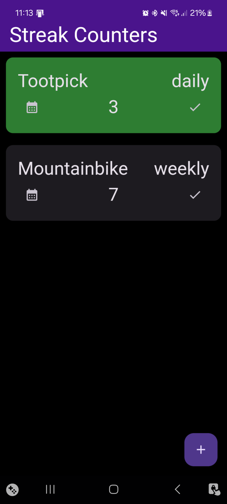
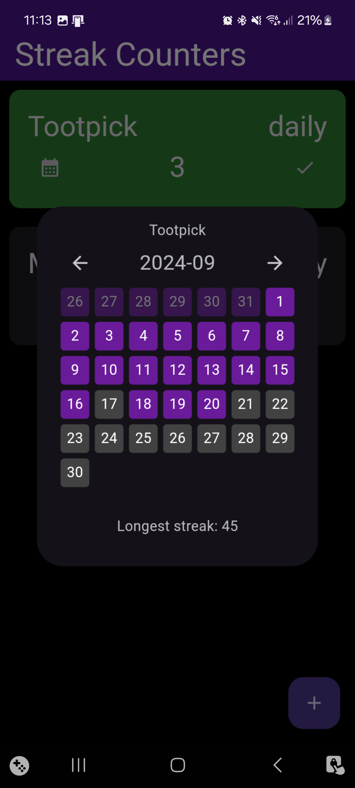
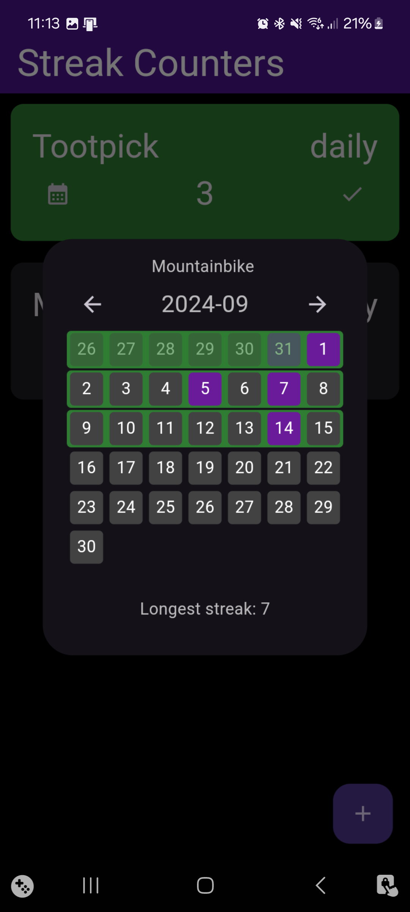

# StreakCounters

A simple app for tracking daily, weakly or monthly activities and showing them in streaks,
kind of like duo lingo but for anything.





The latest version of the app apk can be downloaded
from [the release page](https://github.com/wiemanboy/StreakCounters/releases).

Currently, the app is only available for android as building for ios requires a macOS instance and
that would see me go through my action minutes 10x faster.

Refer to the
flutter [macOS setup documentation](https://docs.flutter.dev/get-started/install/macos/mobile-ios)
and [ios build documentation](https://docs.flutter.dev/deployment/ios) if you have a macOS
instance and want to build the app yourself.

## Getting Started

This project is build using flutter.

For help getting started with Flutter development, view
[the online documentation](https://docs.flutter.dev/), which offers tutorials,
samples, guidance on mobile development, and a full API reference.

## ObjectBox

This project uses ObjectBox for storing data.

The following command is used to generate the objectbox files based on the models.

```bash
dart run build_runner build
```

## Testing

Test files are located in the test directory,
all files must be appended with `_test.dart` for flutter to recognize them.

These can then be run using the following command:
```bash
flutter test
```

## Building

Before building the app, the icons must be generated using the following command:

```bash
dart run flutter_launcher_icons
```

This will generate the different icons needed for the app based of the `app_icon.png` file, defined
in the `pubspec.yml`.

```bash
flutter build apk --release
```